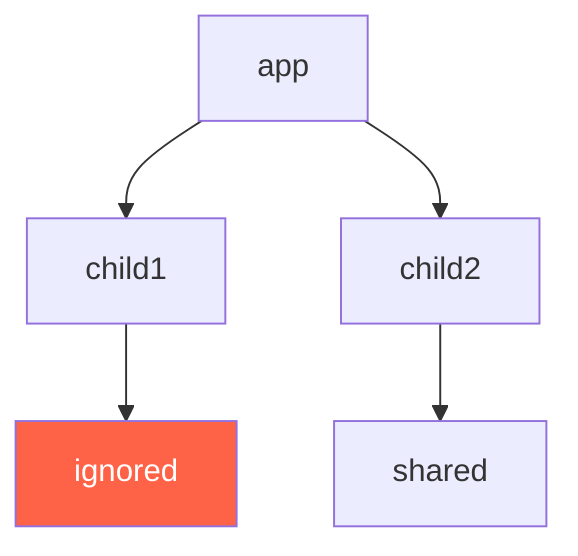
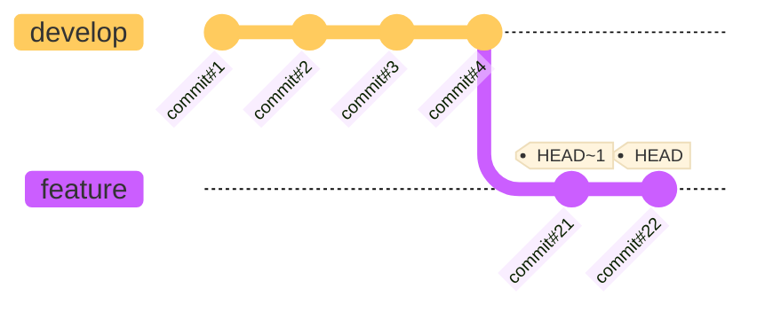

```mermaid
flowchart TB;
    app --> child1
    app --> child2
    child2 --> shared
    child1 --> ignored:::ignore
    classDef ignore fill:tomato,color:white
```

```mermaid
%%{init: { 'logLevel': 'debug', 'theme': 'base', 'gitGraph': {'showBranches': true, 'showCommitLabel':true,'mainBranchName': 'develop'}} }%%
gitGraph
    commit id:"commit#1"
    commit id:"commit#2"
    commit id:"commit#3"
    commit id:"commit#4"
    branch feature
    checkout feature
    commit id:"commit#21" tag: "HEAD~1"
    commit id:"commit#22" tag: "HEAD"
```
