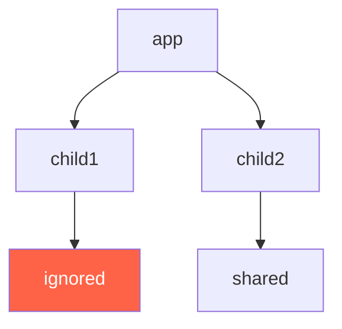
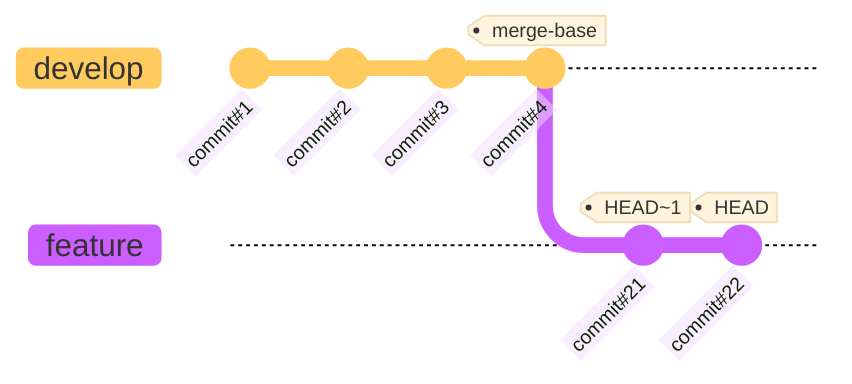
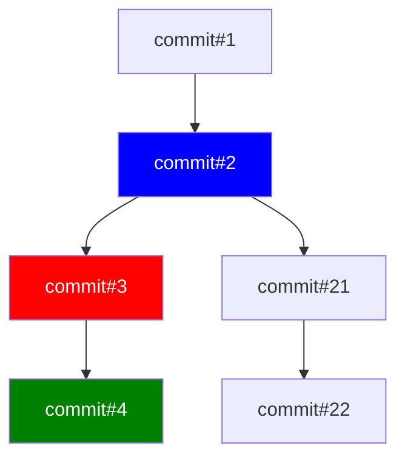

```mermaid
flowchart TB;
    app --> child1
    app --> child2
    child2 --> shared
    child1 --> ignored:::ignore
    classDef ignore fill:tomato,color:white
```

```mermaid
%%{init: { 'logLevel': 'debug', 'theme': 'base', 'gitGraph': {'showBranches': true, 'showCommitLabel':true,'mainBranchName': 'develop'}} }%%
gitGraph
    commit id:"commit#1"
    commit id:"commit#2"
    commit id:"commit#3"
    commit id:"commit#4" tag: "merge-base"
    branch feature
    checkout feature
    commit id:"commit#21" tag: "HEAD~1"
    commit id:"commit#22" tag: "HEAD"
```

```mermaid
flowchart TD;
    commit#1-->commit#2
    commit#2:::deployed-->commit#3
    commit#3:::error-->commit#4:::ok
    commit#2-->commit#21 
    commit#21-->commit#22
    
    classDef error fill:red,color:white
    classDef ok fill:green,color:white
    classDef deployed fill:blue,color:white
```
